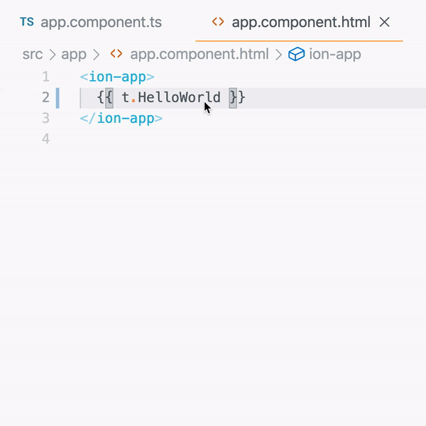
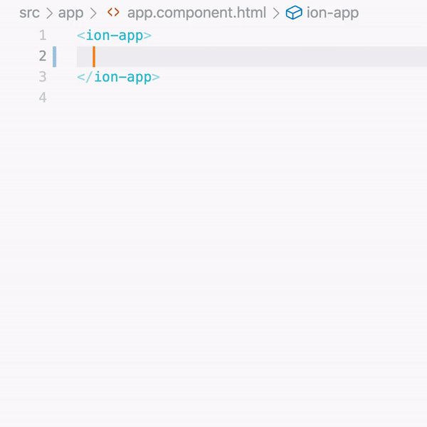

<p align="center">
  
  <h1 style="margin: 0; text-align: center">@Translations Typescript Decorator</h1>
</p>

Typescripts decorator which helps in:
- All translations in one place with its key
- `Go To Definition` support
- Parameterized translations
- Missing translation generation for quick prototyping
<div style="text-align: center">
 
</div>
### Install

Install dependencies with npm:

```bash
npm i mustafah/translations
```

### Import
```ts
import Translations from 'translations';
```

### Define your languages
```ts
enum Languages {
  Arabic,
  English,
  German,
  French
}
import { configTranslations } from 'translations';
configTranslations({ languagesEnum: Languages });
```
### ❤️ Add translations to your class
```ts
@Component({ ... })
export class Component {
  @Translations()
  t = {
    HelloWorld: [
      'مرحباً بالعالم',
      'Hello World',
      'Hallo Welt',
      'Bonjour le Monde'
    ]
  };
}
```
### 💬 Set current language
```ts
setTranslationLanguage(Languages.English);
```
<hr/>
### 😊 Parameterized translations
```ts
  @Translations()
  t: any = {
    WelcomeTo: (country) => [
      `أهلاً بك في ${country}`,
      `Welcome to ${country}`,
      `Willkommen in ${country}`,
      `Bienvenue en ${country}`
    ],
    // Countries
    Egypt: ['مصر', 'Egypt', 'Ägypten', 'Égypte'],
    Germany: ['ألمانيا', 'Germany', 'Deutschland', 'Allemagne']
  };

  setTranslationLanguage(Languages.English);
  console.log(this.t.WelcomeTo(this.t.Egypt));
  // Welcome to Egypt

  setTranslationLanguage(Languages.German);
  console.log(this.t.WelcomeTo(this.t.Germany));
  // Willkommen in Deutschland
```
<hr/>

### 🚀 Missing translations generation
<div style="text-align: center">
 
</div>